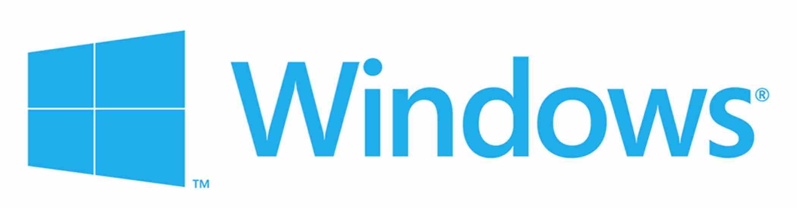

## File system

Drives with assigned letters
## Registry

Place for programs and windows to store settings

---
# Quests:

# 🏅️
# Tell what each of those hotkeys does

# `Win + X` 
# `Win + I`

# `Win + D`
# `Ctrl + Alt + Delete`
# `Win + L`
# Editing:

# `Shift + Ctrl + N` in file explorer
# `Ctrl+C Ctrl+X Ctrl+V`
# `Win + Space`

# `Ctrl + A`

# `Ctrl + Z`

# 🏅️

# Homework:
# 👍

