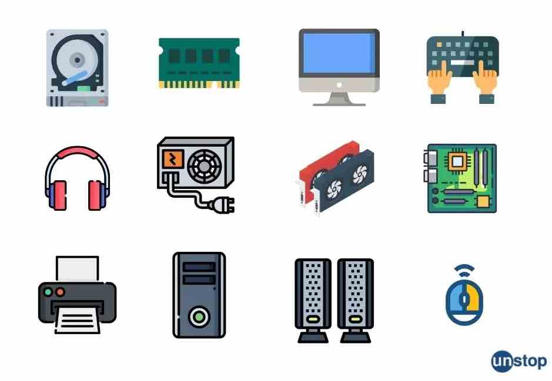

# Theory

> Computer science is the study of computation, information, and automation. 
>
> -- <cite>[Wikipedia](https://en.wikipedia.org/wiki/Computer_science)</cite>

To accomplish the abovementioned goals of computation, information and automation a computer is frequently used.  
There are three main parts by which computer is divided:
- Hardware
- Software
- Data

> Hardware - interconnected electronic components which perform analog or logic operations on received and locally stored information to produce as output or store resulting new information or to provide control for output actuator mechanisms 
>
> -- <cite> [Wikipedia](https://en.wikipedia.org/wiki/Electronic_hardware) </cite>

> Software - computer programs that instruct the execution of a computer. Software can be defined broadly to include design documents, specifications, and testing suites.
>
> -- <cite> [Wikipedia](https://en.wikipedia.org/wiki/Software) </cite>

> Data - smallest units of factual information that can be used as a basis for calculation, reasoning, or discussion.
>
> -- <cite> [Wikipedia](https://en.wikipedia.org/wiki/Data) </cite>

# Quests

## 1. 👍  Research about first computer
## 2. 🔑 Tell me what a computer bug is and its history
## 3. 🏅️ What is Turing's machine?
## 4. 🏆 What are the differences between the computer and a human?

# Homework
Remember the definitions