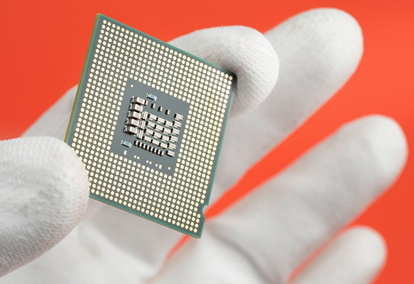

# Theory
CPU - Central processing unit, aka brain of the computer. It consists of many many parts which are connected together through electricity. It performs a huge amount arithmetics with binary numbers which allow complex programs to emerge. One of the main CPUs are logic gates.

Modern CPUs have multiple cores which allow paralleism: ability to execute multiple tasks simultaneously. Moore Law of tech progress.

>Projection that number of transistors in an integrated circuit doubles every two years
> -- <cite>Moore's Law</cite>

Current size of transistors is 5 nm

Intel, AMD, Apple, Qualcom - manufactures

# Quests

## 1. 👍  Tell an exact model of CPU on your computer
## 2. 🔑 ⚪
## 3. 🏅️ ⚪
## 4. 🏆 ⚪

# Homework
Select a model of CPU and write about it
