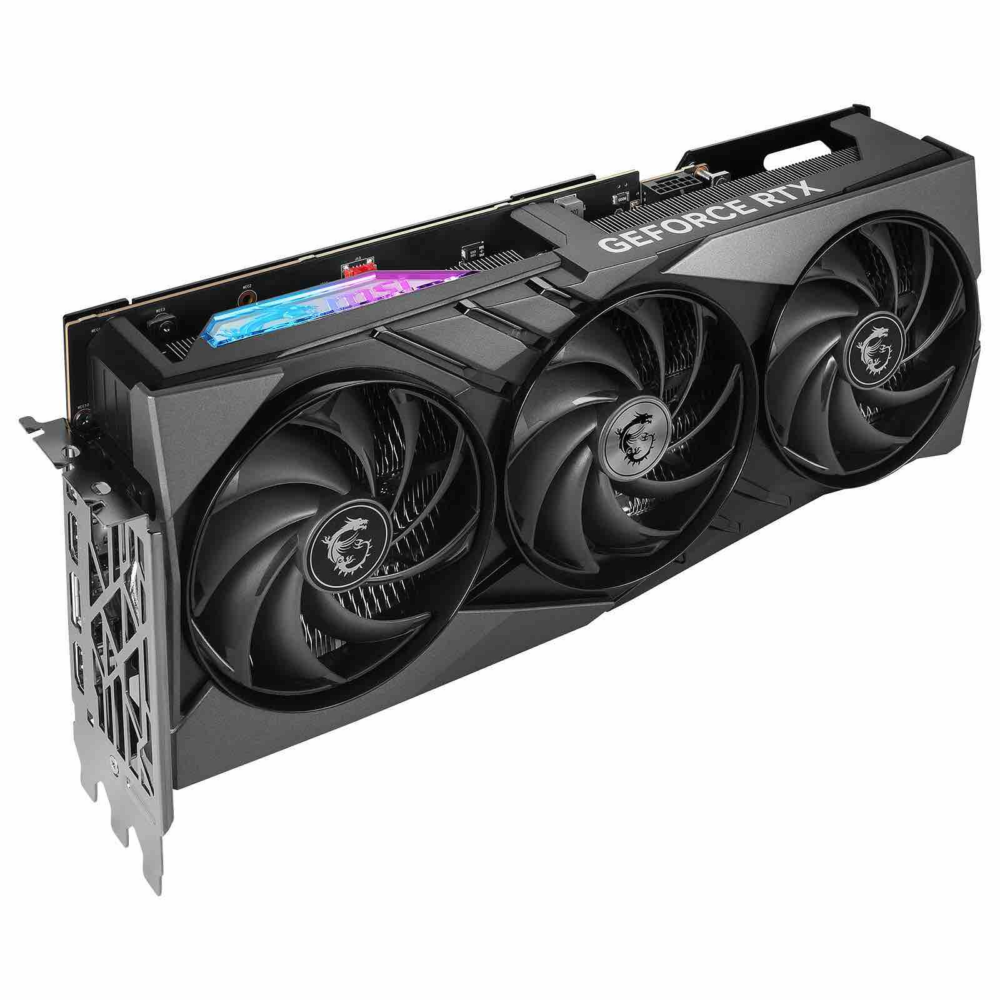

# Theory
GPUs - Graphical Processing Unit, used for rendering to the screen. 

Rendering - applying colors in realistic/stylistic way.

The main difference with CPUs is huge amount of parallel computations. When CPU contains 20 cores, GPU contain thousands of them. So this is the reason of its existence.

Factors for increasing price of GPUs
1. Games
2. Films, Architecture design
3. Cryptocurrency
4. AI (ChatGPT, AI art)

# Quests

## 1. 👍  What was the top limit of quality for computer without the GPU?
## 2. 🔑 ⚪
## 3. 🏅️ ⚪
## 4. 🏆 ⚪

# Homework

### Homework
Find 3 exact models of GPUs and tell about them.

### Quest
Tell an exact model of the GPU on your computer
