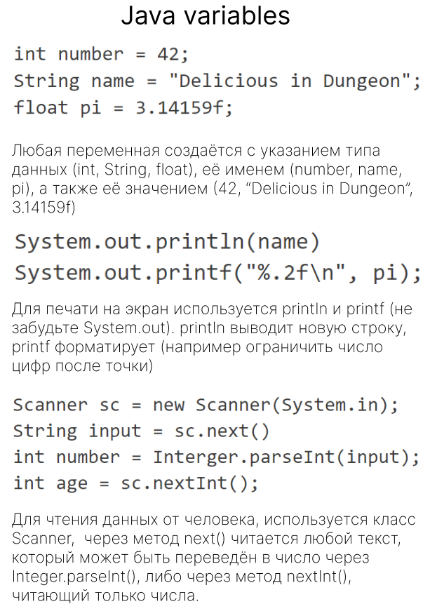

Любая переменная создаётся с указанием типа данных (int, String, float), её именем (number, name, pi), а также её значением (42, “Delicious in Dungeon”, 3.14159f)
```java
int number = 42;
String name = "Delicious in Dungeon";
float pi = 3.14159f;
```

  
Для печати на экран используется println и printf (не забудьте System.out). println выводит новую строку, printf форматирует (например ограничить число цифр после точки)
```java
System.out.println(name);
System.out.printf("%.2f\n", pi);
```

  
Для чтения данных от человека, используется класс Scanner, через метод next() читается любой текст, который может быть переведён в число через Integer.parseInt(), либо через метод nextInt(), читающий только числа.
```java
Scanner sc = new Scanner(System.in);
String input = sc.next();
int number = Integer.parseInt(input);
int age = sc.nextInt();
```

