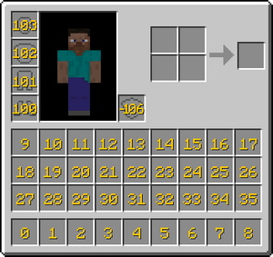

Майнкрафт был создан одним человеком, Notch, который затем продал его 

В Майнкрафте очень важно использовать инвентарь
 

Ячейки с 0 до 8 это быстрая панель, которую вы видите в реальном мире снизу от сердечек. Чтобы выбрать предмет, нажмите цифру или прокрутите колёсико.

Можно создавать предметы в инвентаре, например положив бревно в окно крафта, получив четыре доски.

## Рецепт

